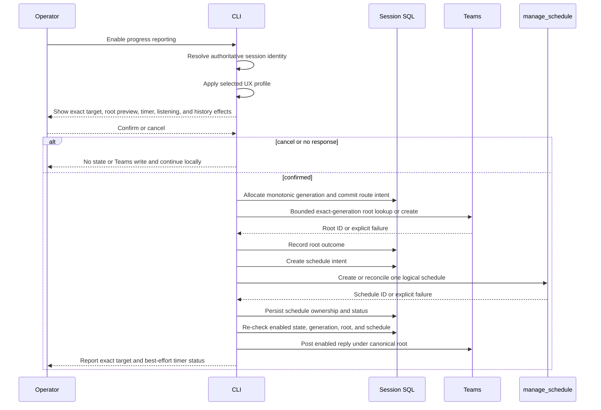
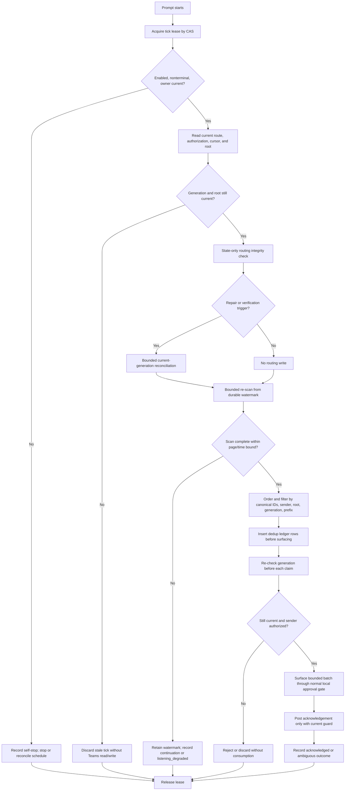
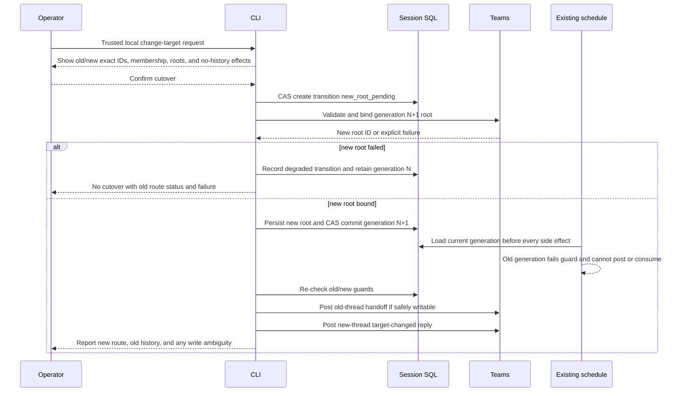

# Refined Design: Configurable Teams Target and Unified Routing Timer

**Stage:** DevDude Feature Design, Step 4 — Architecture Critique and Design Refinement
**Task ID:** `design-refinement`
**Date:** 2026-10-01
**Approval status:** No design is approved. This document is the refined design menu for the
explicit user gate. It does not define an implementation plan and does not modify production code,
tests, dependencies, run state, handoff YAML, or the architecture critique artifact.

## 1. Objective and refinement outcome

The feature replaces the hard-coded Teams destination and blocked-only listener with one session
owned, recurring routing/listening timer. The operator selects a destination through one of three
input profiles; the profiles change only how a canonical target is selected and confirmed. They do
not select different backends, state models, authorization rules, or timer semantics.

This refinement incorporates the architecture critique (`.tmp/architecture-review.md`) and UX
guidance (`ux-review.md`). Critical and high findings are either resolved normatively below or
remain explicit blockers/questions. Medium and low findings retain visible dispositions in §11.

### Completion evidence

- The shared routing/timer core is normative and independent of selection UX.
- `route_generation` is strictly monotonic for the session, including disable/re-enable.
- Root identity is generation-specific; history is never migrated or silently merged.
- Teams-originated text has an immutable untrusted provenance boundary.
- Authorization state is independent from destination state, with explicit provisioning and
  empty-set behavior.
- Schedule creation/replacement, tick ownership, stale-tick checks, cursor, deduplication,
  reconciliation, disable, and terminal cleanup have defined semantics.
- Routing reinforcement is validation/reconciliation, not periodic reposting.
- Canonical IDs are the only routing identity.
- Failure and ambiguity semantics are explicit.
- Profiles A, B, and C are selectable UX profiles and may be combined only as stated.
- Mermaid diagrams are validated or the fallback is reported in §12.

## 2. Evidence, boundaries, and terminology

### 2.1 Authorized evidence

| Artifact | Use |
|---|---|
| `original-request.md` | Required discovery, session slug, retargeting, unified recurring timer, and removal of blocked-only listener. |
| `investigation.md` | Current hard-coded routing, blocked-only listener, reusable fail-closed and reconciliation mechanisms, and gaps. |
| `ux-review.md` | Text-only selection, confirmation, duplicate-name, cancellation, status, handoff, accessibility, and no-response guidance. |
| `resources-investigation.md` | Teams MCP capabilities, scheduler behavior, pagination constraints, and best-effort limitations. |
| `SKILL.md` | Existing identity, exact-ID, safe-content, authorization, root, timestamp, scheduler, and cleanup invariants. |
| `.tmp/architecture-review.md` | Architecture findings AR-01 through AR-30 and required corrections. |

No `docs\ArchOverview` artifact exists for this feature. That absence is non-blocking and remains
visible as a documentation gap.

### 2.2 Normative terms

- **Canonical ID:** Exact Teams `team_id`, `channel_id`, or `root_message_id`. Only canonical IDs
  may route, validate, read, or write.
- **Slug:** Opaque, session-scoped display alias indexing a route-generation record. It is not an
  identity, authorization token, or Teams lookup key.
- **Generation:** A strictly increasing session-wide integer identifying one logical route epoch.
- **Current generation:** The generation whose state is authoritative after a committed cutover.
- **Root:** One canonical Teams root message for one session and one generation. A root is never
  moved or history-merged.
- **Trusted local control:** A command or confirmation originating from the active CLI/session
  interaction, before any Teams-originated text is surfaced. A Teams reply cannot become trusted
  merely because the timer surfaced it.
- **Listening:** Best-effort polling and surfacing of authorized Teams replies. It is not a webhook,
  durable external queue, or guaranteed interrupt.

### 2.3 Non-negotiable boundaries

1. Exactly one logical route is active per session.
2. Exactly one logical schedule owner exists per session; external duplicates are reconciled.
3. The schedule prompt contains only `session_id` and a stable logical schedule key. It never
   carries authoritative route, root, generation, cursor, or authorization data.
4. Every external read or write is preceded by a current-state and generation guard appropriate to
   that operation.
5. No Teams-originated text parses or changes enablement, disablement, target, slug, cadence,
   allowlist, schedule ownership, or immutable controls.
6. Display names, membership labels, slugs, and ID fragments are presentation selectors only.
7. Discovery does not prove postability. The first root write is the authoritative postability
   test, and failure is reported without fallback posting.
8. No history migration occurs on retarget. Old replies remain in the old thread and are not read
   after cutover.

## 3. Normative shared routing and timer core

### 3.1 Durable state schema

The exact physical tables remain an implementation decision. The following logical records and
fields are normative; fields may be normalized, but the stated uniqueness, revisions, and
transitions must remain durable.

| Record | Required fields and semantics |
|---|---|
| **Session lifecycle** | `session_id` unique; `enabled`; `status` (`disabled`, `enabled`, `transition_pending`, `degraded`, `terminal`); `terminal_at`; `last_error`. Terminal cleanup sets `enabled=false`. |
| **Generation counter** | `session_id` unique; `next_generation` or equivalent durable counter. Allocation is transactional and strictly monotonic; it is never reset, reused, or recomputed from the current route. |
| **Route generation** | `session_id`, `generation`, opaque `slug`, exact `team_id`, exact `channel_id`, display diagnostics, membership type, `root_message_id`, `root_state`, timestamps. Slugs and generations are never reused. |
| **Generation history** | Immutable `(generation, slug, team_id, channel_id, root_message_id, state)` tuples. Returning to a prior channel always gets a new generation and new root marker. |
| **Authorization** | Separate `session_id`, `authorization_revision`, `authorized_sender_ids`, `provisioning_state`, `updated_by`, `updated_at`, audit history. Retarget never writes this record. |
| **Schedule ownership** | `session_id`, stable `logical_schedule_key`, `schedule_id`, `schedule_generation`, `status` (`intent`, `creating`, `active`, `stop_requested`, `stopped`, `stop_failed`, `unknown`), lease owner/expiry, last tick, last error, throttle state. |
| **Reply cursor** | `session_id`, `generation`, `root_message_id`, durable watermark `(createdDateTime, message_id)`, scan state, `backlog_state`, `last_scan_at`. A Teams `nextLink` is never persisted across ticks. |
| **Reply ledger** | `(session_id, generation, root_message_id, message_id)` unique; sender ID, observed time, decision (`unseen`, `rejected`, `claimed`, `surfaced`, `ack_pending`, `acknowledged`, `ambiguous`, `failed`), claim token, acknowledgement identity/uncertainty. |
| **Transition** | `session_id`, `from_generation`, `to_generation`, old/new canonical route and root IDs, state (`planned`, `new_root_pending`, `root_bound`, `committed`, `handoff_pending`, `complete`, `degraded`), and timestamps. Written before any new-channel write. |

The current route row may reference `authorized_sender_ids` for display, but authorization is
never copied, inferred, or changed as a side effect of route selection.

### 3.2 Generation and root identity

`route_generation` is strictly monotonic for the lifetime of `session_id`, including process
restart, session reopen, disable, re-enable, and A→B→A retargeting. A transaction allocates the
next value before the route becomes current. A stale operation is valid only if its captured
generation equals the current generation and the current root ID also equals its captured root ID.

The canonical root marker includes both session identity and generation, for example:

```text
Session ID: <SESSION_ID>
Route generation: <GENERATION>
```

The exact safe root text remains subject to the privacy question in §10, but generation identity
must be present. A prior-generation root is never reused, even when the channel is selected again.
A root lookup may reuse only an exact marker for the current generation and only within the
bounded scan rules. If uniqueness cannot be proven, no write occurs.

### 3.3 Authorization and provenance

The initial `authorized_sender_ids` allowlist is provisioned through the trusted local/session
path. The conservative default is to retain the existing fixed authorized sender ID as the
initial allowlist, unless the user gate selects another independently trusted source. Target
membership, display name, Teams audience, and message content never provision authorization.

Allowlist changes are separate confirmed, logged local controls with a new authorization revision.
Retarget does not modify the allowlist. If the allowlist is absent, unresolved, or empty:

- progress posting remains enabled if the route is otherwise valid;
- listening is disabled and reported as disabled;
- no sender is accepted by default;
- no empty-set fail-open behavior is permitted.

Every surfaced instruction carries an immutable provenance tag such as `teams-origin`. It is
untrusted operator input and may be summarized or presented to the active workflow only through the
normal local confirmation/approval gate. It cannot directly invoke retarget, enable, disable,
allowlist changes, cadence changes, or any immutable control. A locally typed control that quotes
Teams text remains local only if the active CLI/session interaction explicitly confirms the control.

### 3.4 Enable and profile-independent confirmation

Every profile resolves to the same confirmation gate. Before confirmation there is no slug
persistence, root write, schedule creation, or route mutation.

The gate displays:

- team and channel display names plus exact short ID fragments;
- membership type (`standard`, `private`, or `shared`) and any audience caveat;
- the literal sanitized root text or a clear disclosure preview;
- session-scoped slug behavior and generation number;
- one root per generation and no-history-migration behavior;
- continuous best-effort listening, selected cadence, nominal latency, and cost caveat;
- authorization/listening status;
- `[y] confirm`, `[r] reselect`, and `[c] cancel`.

After confirmation, the trusted local path:

1. resolves authoritative session identity and fails closed if ambiguous;
2. revalidates exact target IDs and metadata;
3. transactionally allocates a never-used generation and slug;
4. commits route state and a root-binding intent;
5. performs bounded exact-marker root reuse or creates a new root;
6. records root identity or the exact failure state;
7. creates/reconciles the one schedule using the schedule contract in §3.6;
8. posts the enabled reply only after a current-generation guard.

If no operator answers the selection or confirmation within the bounded local interaction window,
the operation cancels with zero persistence and zero Teams writes. Work continues locally and the
status says that Teams enablement was not completed due to no response.



### 3.5 Routing reinforcement

“Idempotently reinforces notification routing” means a state-integrity check and bounded
reconciliation, not periodic reposting. A normal tick:

1. reads current session, route, root, authorization, and schedule state;
2. verifies the current generation, canonical IDs, root binding, and logical schedule ownership;
3. performs no Teams write when state is complete and no uncertainty is recorded;
4. attempts only the current-generation repair when state is incomplete or a prior operation is
   uncertain;
5. records the result and never creates a duplicate root or notification post merely because a
   timer prompt was retried.

Teams verification is restricted to the first tick after enable or retarget, after a recorded
failure/uncertainty, and a bounded exponential-backoff probe. It is not unconditional per tick.

### 3.6 Authoritative schedule ownership and transactions

The schedule row is the authoritative logical owner. All create/replace operations use a
transactional compare-and-swap (CAS) on `(session_id, logical_schedule_key, expected_revision)`:

- write an `intent`/`creating` row before calling `manage_schedule create`;
- create the schedule with only `session_id` and `logical_schedule_key` in its prompt;
- persist the returned `schedule_id` immediately;
- if persistence fails, stop the newly created schedule and record `stop_failed` or `unknown`;
- reconcile live schedules by stable logical key and persisted ID, never by prompt text;
- replace only after the old owner is stopped or explicitly marked uncertain;
- never allow two active owners to be reported as one.

Each tick obtains a lease with an owner token and expiry using CAS. An expired lease may be
reclaimed only after a fresh state read. An overrun tick cannot start a second side-effecting tick;
the next prompt records an overlap/overrun and waits for lease expiry or reconciliation.

The prompt is best effort. The schedule executes only while the Copilot session is running and
may be restored on reopen. The nominal detection latency is at most one cadence interval only
when the prompt runs, Teams reads complete, the backlog is within bounds, and the session can
accept the work. Active-turn and blocking-command interruption are not proven by the available
runtime and must not be claimed as guaranteed.

### 3.7 Tick ordering, cursor, and deduplication

Before every Teams read and every Teams write, the tick verifies: session is enabled and not
terminal, schedule ownership is current, generation/root/IDs match, authorization revision is
read, and no stop/transition guard forbids the action. A terminal or disabled session self-stops
before any Teams read or write.

Polling uses the current root only:

1. read replies in bounded pages;
2. sort the safely obtained set by `(createdDateTime, message_id)`;
3. compare exact sender ID, root, generation marker, and `[ToAgent]` prefix;
4. insert a reply-ledger row before surfacing or acknowledging it;
5. advance the watermark only after the scan is complete through its bounded window;
6. if a page bound, time budget, read failure, or pagination exhaustion prevents completeness,
   retain the prior watermark and record continuation state.

Cross-tick `nextLink` reuse is forbidden because expiry/snapshot semantics are not established.
Continuation is a bounded re-scan from the durable watermark with an overlap window and a
per-tick page/time budget. If the backlog exceeds that budget for a configured number of ticks,
the state becomes `listening_degraded` with reason `backlog exceeds scan bound`; status and the
completion block report the degradation. The bound may increase within an explicit maximum, but
the system never presents starved listening as healthy.

The normative consumption choice is **batch drain of all safely established qualifying messages
in one tick**, in chronological order, subject to a maximum accepted-message count. A later
message does not silently supersede an earlier accepted message. Remaining backlog depth is
reported when the maximum is reached. This avoids the unbounded ten-minute-per-message delay of
single-message ticks while retaining bounded work.

For each accepted message, local surfacing and acknowledgement are independent ledger transitions.
An acknowledgement write with unknown outcome becomes `ack_pending`/`ambiguous`; reconciliation
searches by canonical returned identity when available and otherwise prevents an unbounded retry
storm. No exactly-once external delivery claim is made.



### 3.8 Retarget and cutover

Retarget is a trusted local CLI/session interaction. A Teams reply cannot request it. The
confirmation shows old and new exact IDs, membership, root preview, no-history migration, and the
effect on queued replies.

The transition record is written as `new_root_pending` **before** any write to the new channel.
The system then validates the exact new target and creates/binds a generation-specific root. Only
after the root identity is durable may the transaction commit the new current generation. This
ordering makes an orphan new-channel root discoverable and compensable. If root creation succeeds
but commit fails, reconciliation uses the transition record; it never silently creates a second
root or treats the orphan as current.

After commit, the old generation is stale. The old thread may receive one safe hand-off reply if
the old root remains writable and the guard still permits it. Failure or ambiguity is recorded;
the system never claims the hand-off was posted. The new root may receive one target-changed reply.
The single schedule remains owned by the session and reads only the new current root after the
cutover. Messages first observed in the old root after cutover are rejected and ledgered, not
consumed.



### 3.9 Disable, terminal cleanup, and reconciliation

**Disable** is a first-class trusted local control. It transactionally sets `enabled=false`,
marks the route `disabled` (not terminal), and requests schedule stop by persisted handle. It
posts at most one safe disabled notice if the current root and generation remain valid. A failed
or unknown stop is recorded as `stop_failed`; the system does not claim success.

**Terminal cleanup** sets `enabled=false`, marks the route and consumption state `terminal`,
attempts one terminal reply under a current guard, and requests schedule stop. It reconciles
orphan/unknown schedules by logical key and persisted ID. A `stop_failed` record obliges the next
tick and the next enable to attempt reconciliation and stop. The named recovery owner is the
session's next schedule tick when restored, or the next trusted local enable/status/disable
operation if no tick can run.

Every tick checks terminal/disabled state before any Teams read or write and self-stops. If a
restored schedule belongs to a disabled or terminal session, it performs only schedule
reconciliation and no Teams operation.

## 4. Selectable UX profiles

The following profiles are mutually exclusive at the entry surface but share every rule in §3.
They may be combined only as a deliberate UX composition:

- **Recommended composition:** Profile A as the default surface, with Profile B's remembered-target
  shortcut added as an optional branch. The shortcut still requires canonical revalidation and
  explicit confirmation; it does not bypass selection policy or any core guard.
- Profile C may be layered on top of A or B as an invocation shortcut only if its parser and
  ambiguity disclosures are maintained. It never changes the confirmation gate.
- No profile may alter authorization, timer ownership, generation, cursor, root, or failure
  semantics.

### 4.1 Profile A — Explicit interactive every enable/change

The CLI presents teams, then channels, using plain-text numbered rows. Duplicate names include
short ID fragments and membership type. Because the adapter does not expose complete pagination for
team/channel discovery, the surface says exactly how many returned items are shown and never claims
tenant-wide completeness. Search is a filter over returned items, not an identity resolver.

```text
Select the Teams team for session progress.
12 teams returned; showing 1-10. Names may be duplicated; completeness is adapter-bounded.
[1] Contoso Platform Engineering - id ...8cf98
[2] Contoso Platform Engineering - id ...4a21 (duplicate name)
[m] more returned items  [s] filter returned items  [c] cancel
```

Every retarget repeats selection and the same confirmation. This is the recommended default
because it maximizes explicit audience review without weakening the core.

### 4.2 Profile B — Remembered session alias with canonical revalidation

After a confirmed route exists, the session may show its opaque alias first:

```text
Remembered session target:
Contoso Platform Engineering > Build Alerts (standard, id ...b3F72)
Alias: sess-7K4M; canonical IDs will be revalidated.
[y] revalidate and confirm this target  [c] choose another  [x] cancel
```

The `y` path is an explicit confirmation of the remembered target, not an automatic enable. The
mapping is immutable for its generation. There is no “changed IDs” state: the only revalidation
outcomes are the same exact IDs reachable (continue to confirmation), the same IDs unreachable or
deleted (fail closed and offer reselection), or an explicit new target (new generation). Names are
never used to re-resolve an alias.

### 4.3 Profile C — Declarative selector with mandatory confirmation

The operator may provide a known session slug or an exact canonical ID as a lookup hint. Name
search is permitted only as a filter over returned candidates and never auto-selects an item when
completeness is unproven. ID fragments are display aids only and are forbidden as selection input.
An exact ID must resolve to a returned, revalidated target and still requires confirmation.

If a candidate list is incomplete, the confirmation says: “N matches among returned items;
completeness unverified.” Zero or multiple matches return to the full selection surface. Parser
errors are plain text and side-effect-free. Teams-origin text is never passed to this parser.

## 5. Status, listening, and UX semantics

The status surface is a core flow, not a profile feature. It reports:

- current exact target display names and short canonical ID fragments;
- current slug, generation, root state, and no-history behavior;
- enabled/disabled/terminal status;
- schedule logical key, external handle state, lease/reconciliation state;
- cadence, nominal latency, best-effort/session-running limitation;
- authorization provisioning state and listening enabled/disabled;
- cursor watermark, backlog depth/state, page exhaustion, and `listening_degraded` reason;
- last routing verification and last error/ambiguity.

Teams notices remain concise and safe. They disclose the destination on enable, target change,
disable, blocker, resumed/acknowledged instruction, and terminal completion where the current root
is valid. They do not include credentials, secrets, raw logs, or untrusted instruction text beyond
the safe summary needed for operator clarity.

The completion block retains a bounded format but must include destination, generation, timer state,
listening state, and any degraded/ambiguous outcome. A no-response selection is not `ERR-POST` or
`ERR-TIMEOUT`; it is a local cancellation with no side effects. Timer/scheduler unavailability,
target failure, paging exhaustion, authorization mismatch, and acknowledgement ambiguity each retain
their distinct status and do not collapse into “enabled”.

## 6. Failure and ambiguity semantics

| Condition | Required behavior |
|---|---|
| Session identity ambiguous or unavailable | No Teams read/write or schedule creation; continue locally; report fail closed. |
| No teams/channels returned | No persistence or write; offer cancel/back; continue locally. |
| Duplicate display names | Require exact row selection or exact canonical ID; never first-match. |
| Target stale, deleted, inaccessible, or post fails | Do not substitute another target; preserve prior route on retarget; offer reselection; report exact degraded state. |
| Authorization absent/empty/unresolvable | Posting may remain enabled; listening is disabled and reported; never accept any sender. |
| Authorization sender mismatch/prefix/root mismatch | Ledger as rejected; do not surface, consume, acknowledge, or mutate controls. |
| Schedule persistence failure after create | Stop newly created schedule; record `stop_failed`/`unknown`; do not claim active ownership. |
| Concurrent schedule creation | CAS/intent row makes one owner authoritative; reconcile extras by logical key and handle; never report duplicate success. |
| Orphan root after failed cutover | Transition record makes it discoverable; reconcile or mark degraded; never silently reuse or duplicate. |
| Stale tick or old generation | Stop before external side effect; do not read old replies, consume, or acknowledge. |
| Disable | Mark disabled first; stop by handle; at most one guarded notice; `stop_failed` remains visible. |
| Terminal cleanup | Set enabled false, mark terminal, stop/reconcile schedule, guarded terminal reply only; no restored tick may post. |
| Scheduler unavailable | Teams progress may continue only if a root is already valid; listening is disabled/degraded and latency is disclosed. |
| Page bound/time budget exhausted | Do not advance watermark; bounded re-scan next tick; escalate to `listening_degraded` after the configured persistence threshold. |
| No operator response | Cancel selection/confirmation with zero state and Teams writes; continue local work. |
| Acknowledgement write ambiguous | Record `ack_pending`/`ambiguous`; reconcile by canonical identity where possible; never claim exactly-once or successful acknowledgement without proof. |
| Active work/blocking prompt cannot be surfaced | Persist/ledger the message if safely observed, report best-effort limitation, and do not claim immediate interruption. |

## 7. Cost, performance, and operational limits

At cadence `C`, an enabled session can generate approximately `24h / C` ticks per day, plus
bounded retries and reply pages. Reinforcement is normally state-only; Teams verification occurs
only on explicit triggers or bounded backoff. Reply reads are capped per tick, and batch drain is
capped by accepted-message count. The user gate must select an interval within the scheduler's
supported range and disclose the latency/cost trade-off; no numeric cadence is silently inherited
from the contradictory current text.

The timer honors service throttling and `Retry-After` when available, records throttle state, and
uses jitter to reduce synchronized session load. Multiple sessions may still poll the same channel;
tenant-level aggregation is a future consideration, not a hidden guarantee. No option claims that
the timer preempts active work or a blocking command.

## 8. Core vocabulary and affected skill surfaces

The future skill revision must use one vocabulary: `route_generation`, `generation`, `root`,
`logical_schedule_key`, `authorized_sender_ids`, `authorization_revision`, `watermark`,
`reply_ledger`, `transition`, `enabled`, `disabled`, `terminal`, `stop_failed`, and
`listening_degraded`. It must not use “listener” for a blocker-owned schedule after this feature.

The affected behavioral surfaces are enablement and selection, durable session state, root binding,
progress routing, blocker handling, timer tick, message surfacing, retarget, status, disable,
terminal cleanup, reconciliation, and completion reporting. This is a design scope statement, not
an implementation plan.

## 9. Recommendation for the explicit user gate

**Recommend the normative core in §3 plus Profile A as the default, with Profile B's remembered
session alias as an optional convenience branch.** This is internally consistent because B's branch
does not bypass explicit revalidation or confirmation; it only reduces repeated selection work.
Profile C should be added only if concise expert invocation is a demonstrated requirement and its
parser, completeness disclosure, and fallback selection surface can be maintained.

The recommendation is about the input surface, not a claim that A/B/C are separate architectures.
The safety-determining decisions are the shared core: generation-specific roots, provenance,
authorization separation, schedule CAS/lease, cursor/ledger semantics, truthful failure states,
and best-effort disclosure.

No option is approved. The user gate must confirm the core policy choices and select a profile or
request a revision.

## 10. Questions explicitly carried to the user gate

These are not hidden unresolved defects; each is named because the supplied evidence cannot decide
it without product/user policy:

1. **Core authorization source:** Should the initial allowlist retain the current fixed sender ID,
   or should the trusted local path provision a different explicit sender set?
2. **Cadence and cost budget:** What interval and maximum acceptable detection latency should the
   user gate select?
3. **Timer lifetime on reopen:** Is “enabled until disable or terminal cleanup, with restored
   schedule reconciliation” acceptable, or is an explicit idle timeout required?
4. **Active-work semantics:** Should messages observed during an active turn be queued for the next
   local approval point, or only surfaced when the runtime is idle? The runtime does not prove
   preemptive delivery.
5. **Backlog escalation threshold:** After how many bound-exhausted ticks should
   `listening_degraded` become operator-visible, within a finite maximum?
6. **Eligible audiences:** Are private and shared channels allowed, conditionally allowed, or
   excluded despite explicit membership-type disclosure?
7. **Root disclosure:** Is the sanitized literal root preview acceptable in the selected audience?
8. **Selection limits:** What maximum returned team/channel rows and local interaction timeout should
   the text-only surfaces use when the adapter cannot prove complete discovery?
9. **Completion cap:** Keep the current five-bullet cap with folded destination/timer fields, or
   permit a larger bounded completion block?
10. **Profile selection:** A, B, C, or the recommended A+B composition? If C is selected, what
    declarative syntax is acceptable?

## 11. Architecture critique disposition matrix

| Finding | Severity | Disposition in this refinement |
|---|---|---|
| AR-01 options are not distinct architectures | Critical/high structural | **Resolved:** one normative core; A/B/C are UX profiles only. |
| AR-02 generation reset/ABA | Critical | **Resolved:** durable strictly monotonic session counter across all lifecycle events (§3.2). |
| AR-03 root reuse on A→B→A | Critical | **Resolved:** generation in root marker; immutable generation history; no reuse across generations (§3.2). |
| AR-04 Teams confused deputy/provenance | Critical | **Resolved:** immutable `teams-origin`; Teams text cannot invoke controls (§3.3). |
| AR-05 allowlist provisioning/empty set | Critical | **Resolved with policy question:** default preserves current sender ID; empty means listening disabled; source confirmation remains §10.1. |
| AR-06 authorization coupled to route | Critical | **Resolved:** separate authorization record/revision; retarget never writes it (§3.1, §3.3). |
| AR-07 schedule prompt carries stale authority | High | **Resolved:** prompt contains only session ID and logical key (§2.3, §3.6). |
| AR-08 one schedule owner not constructible | High | **Resolved:** intent-before-create, logical key, CAS, lease, and reconciliation (§3.6). |
| AR-09 zombie timer/reopen | High | **Resolved:** self-stop before reads/writes, terminal `enabled=false`, named recovery owner (§3.9). |
| AR-10 cursor starvation/nextLink | High | **Resolved with policy question:** no cross-tick nextLink; bounded re-scan and visible degradation; threshold remains §10.5. |
| AR-11 orphan root before cutover commit | High | **Resolved:** `new_root_pending` transition before new-channel write (§3.8). |
| AR-12 reinforcement cost undefined | High | **Resolved:** state-only steady state; bounded verification triggers; cost included (§3.5, §7). |
| AR-13 batch/single contradiction | High | **Resolved:** bounded chronological batch drain; remaining depth visible (§3.7). |
| AR-14 changed-ID alias leak | High | **Resolved:** delete changed-ID concept; exact IDs only; no name re-resolution (§4.2). |
| AR-15 incomplete name/fragment selection | High | **Resolved:** names filter returned items; completeness disclosed; fragments forbidden as input (§4.3). |
| AR-16 contradictory A+B recommendation | High | **Resolved:** B may be an explicit revalidation/confirmation branch, not a bypass (§4, §9). |
| AR-17 no disable flow | Medium | **Resolved:** disable is first-class and distinct from terminal (§3.9). |
| AR-18 unattended/no response | Medium | **Resolved:** bounded local cancellation with zero writes (§3.4, §6). |
| AR-19 multi-session polling aggregation | Medium | **Retained limitation:** per-session cost and throttling are disclosed; aggregation is future work (§7, §10). |
| AR-20 root disclosure widening | Medium | **Retained as explicit policy question:** literal preview and safe root text require user decision (§3.4, §10.7). |
| AR-21 acknowledgement ambiguity | Medium | **Resolved:** ledger `ack_pending`/`ambiguous` plus bounded reconciliation (§3.7, §6). |
| AR-22 missing state machines | Medium | **Resolved:** lifecycle, schedule, transition, cursor, and ledger states are named (§3.1, §3.6–§3.9). |
| AR-23 search-as-selector semantics | Medium | **Resolved:** search is a filter; exact row selection and confirmation remain required (§4.1, §4.3). |
| AR-24 cost model omissions | Medium | **Resolved:** reinforcement, pages, retries, jitter, throttling, and concurrency are included (§7). |
| AR-25 UX error/status gaps | Medium | **Resolved:** status fields and distinct failure semantics are specified (§5, §6). |
| AR-26 vocabulary drift | Low | **Resolved:** canonical vocabulary listed in §8. |
| AR-27 non-normative security language | Low | **Resolved:** requirements use normative terms such as “must” and “never”. |
| AR-28 ordering/tiebreak rationale | Low | **Resolved:** message order is `(createdDateTime, message_id)` to make ties deterministic (§3.7). |
| AR-29 profile layering ambiguity | Low | **Resolved:** composition rules are explicit (§4). |
| AR-30 Mermaid validation/document hygiene | Low | **Addressed:** diagrams are isolated and validated/reported in §12. |

## 12. Mermaid validation

This refined document contains three Mermaid blocks: enablement, timer tick, and retarget cutover.
They use simple identifiers, matched branches, and quoted-free labels to avoid parser hazards.

Validation status: **validated successfully with Mermaid CLI (`mmdc`)**. All three Mermaid blocks
were extracted and rendered to SVG with exit code 0 on 2026-10-01. No fallback was required.
