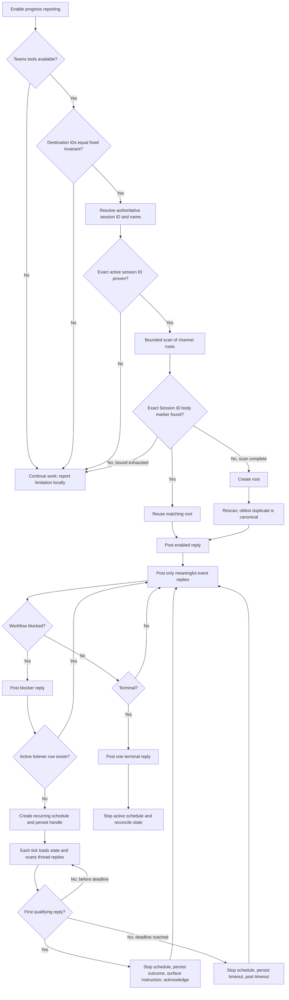
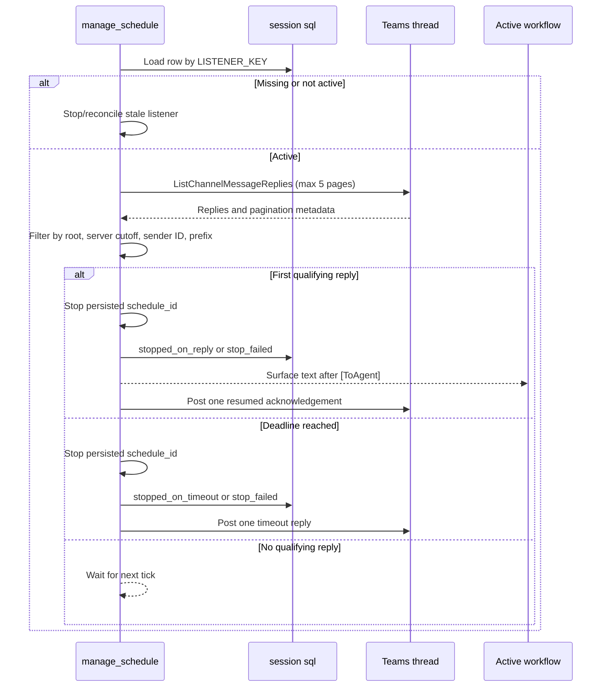

# Code-Flow Investigation: Configurable Teams Target and Unified Timer

## Scope and evidence

This investigation covers only the current `enable-progress-in-teams` behavior relevant to
selectable Teams destinations and a unified recurring routing/message listener. It documents
current execution flow, state, tool interactions, constraints, conventions, reuse candidates, and
unresolved conflicts. It does not select a design or propose an implementation plan.

Authoritative evidence:

- Feature request: `docs/configurable-teams-target-and-timer/original-request.md` (lines 1-13).
- Current behavior: `enable-progress-in-teams/SKILL.md` (especially lines 21-345).
- Validated handoff:
  `docs/configurable-teams-target-and-timer/.dev-dude-handoffs/000-root-to-feature-design.yaml`.
- Run state:
  `docs/configurable-teams-target-and-timer/.dev-dude-run-state.md`.

Repository inspection found that `enable-progress-in-teams` contains only `SKILL.md`; there is no
production implementation or test suite to trace. The skill text is therefore the executable
behavioral contract and sole validation source for this lane. `docs/ArchOverview` does not exist,
so there are no architecture documents to reconcile; this is noted without blocking the
investigation.

## Current-state overview

The skill binds one Copilot session to one hard-coded Teams channel thread. Enablement resolves the
active Copilot session identity, scans the fixed channel for an existing root carrying an exact
session marker, creates a root only when absence can be proven within a bounded scan, and routes
meaningful progress events as replies. A recurring listener is created only after a blocker is
posted. That listener polls the root thread for an authorized `[ToAgent]` reply, stops on the first
accepted reply or after four hours, and persists only listener lifecycle state in session SQLite.
Terminal handling posts one final reply and attempts to stop any active listener.

Primary entry: a natural-language enablement request matching `SKILL.md` **When to Use**
(lines 21-26).

Terminal exits:

- Teams reporting enabled and event routing continues for the session.
- Local-only fallback when identity, destination, Teams access, bounded root lookup, scheduling, or
  state persistence cannot satisfy fail-closed rules.
- Terminal completion/failure reply followed by listener cleanup.

## Current execution flow

Evidence: `SKILL.md` **Phase 1** through **Phase 5** and **Failure handling**
(lines 138-307).

## Detailed flow and constraints

### 1. Enablement and destination binding

Before any Teams write, the skill requires the runtime-resolved `teamId` and `channelId` to equal
one fixed pair. No discovery or user selection occurs. Destination identity is based only on IDs;
display names must not be used because names may change. Any mismatch fails locally and may not
fall back to another channel, chat, direct message, or self-message.

Evidence:

- `SKILL.md` **When NOT to Use** (lines 28-34).
- `SKILL.md` **Hard invariants**, invariant 1 (lines 36-46).
- `SKILL.md` **Phase 1**, step 1 (lines 138-141).
- `SKILL.md` **Failure handling**, destination mismatch (lines 291-307).

Current binding is not persisted as a destination record or slug. The fixed IDs are repeated as
controls in the skill and embedded into the scheduled listener prompt only when a blocker creates a
listener.

### 2. Session identity and root reuse

Root identity is session-centric:

1. Prefer active runtime/conversation metadata for `SESSION_ID` and session summary/name.
2. Otherwise query the local session store by current working directory, most recently updated
   first.
3. Accept the cwd lookup only when it demonstrably corresponds to the active session.
4. Fail closed rather than generate or guess an ID.

The root post must contain the exact session ID in both title and body. Reuse is keyed only by the
literal first body line `Session ID: <SESSION_ID>`; the session name and subject are not keys.
`ListChannelMessages` is paged up to five pages and limited to messages within seven days. If the
bound is exhausted with more results, a new root cannot safely be created. After creation, the scan
runs again to detect a race; the oldest matching root becomes canonical and duplicates are reported
locally but not deleted.

Evidence:

- `SKILL.md` **Session identity contract** and resolution algorithm (lines 87-113).
- `SKILL.md` **Phase 1**, steps 2-5 (lines 142-165).
- `SKILL.md` **Hard invariants**, invariants 2-4 (lines 47-59).

`ROOT_MESSAGE_ID` is described as a runtime value. It is not durably persisted on enablement. It is
written to `teams_progress_listener.parent_message_id` only if a blocked listener is later created.

### 3. Event routing

All events are replies under the canonical root. Allowed events are enabled, meaningful milestone
change, blocked, resumed/response-received, and terminal completion/failure. Routine tool
narration and unchanged status are excluded. Updates must be concise and must not contain secrets,
private code, raw logs, or other sensitive content.

Evidence:

- `SKILL.md` **Phase 2 — Event-driven progress updates** (lines 170-185).
- `SKILL.md` **Hard invariants**, invariants 2 and 8 (lines 47-71).

There is no durable event-routing state, deduplication key, last-posted event marker, or stored
enablement flag. The agent follows the prose convention during the active session.

### 4. Blocked-only listener creation

The current listener starts only when the workflow is blocked and needs a human decision:

1. Query `teams_progress_listener` for an active row for the session.
2. Always post the new blocker reply.
3. If an active row exists, reuse its schedule.
4. Otherwise use the blocker reply's Teams server `createdDateTime` as the message cutoff and
   derive an absolute four-hour deadline.
5. Create a unique key from skill name, session ID, root ID, and blocker server timestamp.
6. Create a recurring schedule with an embedded listener prompt.
7. Persist the returned schedule ID immediately; if persistence fails, stop the newly created
   schedule so no untracked listener remains.

Evidence: `SKILL.md` **Phase 3 — Blocked: post blocker and open (or reuse) a listener**
(lines 187-215).

The blocker timestamp performs two roles: listener creation identity and lower bound for acceptable
operator replies. This model has no equivalent cutoff when the workflow is not blocked, which is a
direct gap for continuous listening.

### 5. Scheduled tick and message acceptance

Each scheduled tick:

1. Loads the row by `LISTENER_KEY` and treats a missing/non-active row as stale.
2. Calls `ListChannelMessageReplies` for the fixed destination and root.
3. Follows up to five pages and evaluates every reply newer than the listener cutoff without
   assuming reply order.
4. Accepts only the first reply satisfying all controls:
   - sender ID exactly equals the hard-coded authorized operator ID;
   - reply belongs to the bound root thread;
   - Teams server time is after the listener cutoff;
   - trimmed body starts exactly with `[ToAgent]`.
5. Stops the schedule using the persisted handle before surfacing the instruction.
6. Persists the true stop outcome and posts exactly one response-received acknowledgement.
7. At the deadline, stops the schedule, persists timeout state, and posts one timeout reply.

If pagination is still incomplete at the five-page bound, the tick may not accept or guess a
message. The text says to continue on a later tick and retain paging state where possible, but the
declared state table has no paging cursor field.

Evidence:

- `SKILL.md` **Phase 4 — Listener tick behavior** (lines 217-256).
- `SKILL.md` **Response-handling rules** (lines 277-289).

### 6. Operator authorization and control immutability

Authorization is one hard-coded Entra/user ID. Display name is diagnostic only. `[ToAgent]` is an
exact leading-token protocol after trimming. Accepted message text remains ordinary user-provided
input and cannot override system, developer, repository, destructive-action, or approval rules.

Teams messages are expressly forbidden from changing destination IDs, authorized sender ID,
message prefix, cadence, deadline, root identity, or listener-state controls. This immutability is
a current safety boundary, but it conflicts with the requested ability to change the destination
during the session unless target changes are handled through a separate trusted CLI/session flow.
The current skill does not define such a flow.

Evidence:

- `SKILL.md` **Hard invariants**, invariants 5 and 7 (lines 60-69).
- `SKILL.md` **Response-handling rules** (lines 277-289).

### 7. Persistence model

The only declared durable state is:

| Field | Current role |
|---|---|
| `listener_key` | Unique listener identity derived from session, root, and blocker timestamp |
| `session_id` | Unique constraint enforcing at most one row/listener per session |
| `parent_message_id` | Root thread ID used by the listener |
| `schedule_id` | Authoritative scheduler stop handle |
| `created_at` | Blocker reply's Teams server timestamp and reply cutoff |
| `deadline` | Absolute four-hour timeout |
| `status` | `active`, `stopped`, `stopped_on_reply`, `stopped_on_timeout`, or `stop_failed` |

Evidence: `SKILL.md` **Durable listener state (session `sql`)** (lines 115-134).

The model does not persist:

- reporting-enabled state;
- selected team/channel or a destination slug;
- channel display metadata;
- canonical root ID before a blocker exists;
- routing generation/version when a target changes;
- last observed or consumed Teams message ID;
- pagination continuation state;
- last event posted or terminal-posted marker;
- timer ownership independent of a blocker.

The unique `session_id` constraint encodes one listener for the whole session, not one listener per
destination or routing generation.

### 8. Terminal cleanup and reconciliation

On completion or failure, the skill posts exactly one terminal reply and stops any active listener
row for the session. Stop success becomes `stopped`; failure becomes `stop_failed` and must be
surfaced locally. On enable and terminal update, persisted rows are reconciled against live
schedules by `schedule_id`, never by prompt text. Stale rows are marked stopped so a future blocker
does not incorrectly reuse them.

Evidence:

- `SKILL.md` **Phase 5 — Terminal update** (lines 258-266).
- `SKILL.md` **Listener state cleanup / reconciliation** (lines 268-275).
- `SKILL.md` **Failure handling**, stop failure (lines 291-307).

Cleanup is listener-centric. There is no explicit terminal cleanup for destination selection,
session routing state, or a continuously running timer because those states do not currently exist.

## Tool interaction map

| Tool/capability | Current use | Constraint relevant to future design |
|---|---|---|
| Teams `ListChannelMessages` | Find/reuse a root by exact body marker | Fixed destination; bounded to 5 pages/7 days; exhaustion fails closed |
| Teams `SendMessageToChannel` | Create one root post | Only after bounded absence is proven; concurrent-create rescan required |
| Teams `ReplyToChannelMessage` | Enabled, milestone, blocked, resumed, timeout, and terminal updates | All writes stay under canonical root |
| Teams `ListChannelMessageReplies` | Poll operator replies during blocked listener ticks | Fixed root; max 5 pages/tick; no ordering assumption |
| Teams `ListTeams` / `ListChannels` | Not currently used | Required request surface for available-destination discovery and selection |
| `manage_schedule create` | Start blocked-only polling schedule | Created only after blocker; prompt embeds routing and authorization controls |
| `manage_schedule stop` | Stop on reply, timeout, terminal, or persistence failure | Must use persisted `schedule_id`; stop failure is explicit |
| `manage_schedule list` | Reconcile persisted rows with live schedules | Match by `schedule_id`; prompt text is not assumed available |
| session `sql` | Store listener lifecycle | No enablement, destination, consumption, or continuous-timer state |
| `session_store_sql` local | Resolve session ID/name fallback | cwd lookup is accepted only when active-session correspondence is proven |

Evidence: `SKILL.md` **Tool preconditions** (lines 73-84), identity and workflow sections
(lines 87-275).

## Requirements-to-current-surface mapping

| Requested behavior | Current surface | Reconciliation required by a future design |
|---|---|---|
| Query available teams/channels and present a selection | No discovery tools in the workflow; destination is fixed by invariant 1 and rejected if different | Define discovery, presentation, stable identity, unavailable/renamed target behavior, and fail-closed write validation without relying on display names |
| Persist selected destination as a session-scoped slug | Only listener state is persisted; destination exists as hard-coded IDs and scheduled-prompt fields | Define slug meaning, mapping to IDs, storage lifecycle, uniqueness, and authoritative source |
| Change target during the session and update slug | Destination and root identity are immutable; no target-change entry point exists | Reconcile trusted change initiation, old/new root ownership, routing cutover, in-flight timer state, and whether prior thread receives a transition/terminal notice |
| Unified recurring timer reinforces routing idempotently | Current schedule exists only for blocked listening and stops on first reply | Define what “reinforces” checks or repairs, how timer identity survives target changes, and whether one schedule remains live for the session |
| Listen continuously while working or blocked | Current cutoff begins at a blocker reply and listener ends after first accepted message or four hours | Define continuous observation window, consumption/deduplication, delivery to active work, and behavior for multiple messages |
| Remove blocked-only listener | Phase 3 and Phase 4 are structurally blocker-owned | Identify which acceptance, pagination, authorization, stop-outcome, and reconciliation mechanics transfer to the unified timer and which blocker-specific fields disappear |

Evidence: feature request lines 5-13 compared with `SKILL.md` invariants and workflow
(lines 36-307).

## Existing mechanisms that are explicit reuse candidates

These are current mechanisms, not design selections:

1. **Authoritative session identity with fail-closed ambiguity handling**
   The ordered runtime-then-local-store resolution protects root and persisted state from binding to
   an invented or wrong session (`SKILL.md`, lines 87-113).

2. **ID-based destination identity**
   Team/channel IDs are authoritative and display names are non-authoritative. This remains relevant
   even when names are shown for selection (`SKILL.md`, lines 36-46).

3. **Exact session marker and bounded root reuse**
   The exact body marker, bounded scan, duplicate race rescan, and oldest-root rule provide an
   idempotent thread-binding mechanism (`SKILL.md`, lines 138-168).

4. **Single-thread event convention**
   One root with concise event-driven replies limits noise and provides a stable place for both
   status and operator messages (`SKILL.md`, lines 47-52 and 170-185).

5. **Server-time message boundaries**
   Teams `createdDateTime`, rather than the local clock, defines reply eligibility
   (`SKILL.md`, lines 187-215).

6. **Bounded, ordering-independent reply pagination**
   Ticks inspect all retrieved replies rather than assuming newest-first ordering and fail safely
   when the page bound is insufficient (`SKILL.md`, lines 217-241).

7. **ID-only operator authorization and exact command prefix**
   Sender ID plus leading `[ToAgent]` is the current acceptance boundary
   (`SKILL.md`, lines 60-69 and 229-241).

8. **Stop-before-act and true stop outcomes**
   The scheduler is stopped by persisted handle before an accepted instruction is acted on, and
   `stop_failed` is represented rather than hidden (`SKILL.md`, lines 242-255 and 277-289).

9. **Create-then-persist compensation**
   If scheduler creation succeeds but state persistence fails, the schedule is immediately stopped,
   preventing an untracked recurring job (`SKILL.md`, lines 203-212).

10. **Schedule reconciliation by handle**
    State is reconciled by `schedule_id`, without depending on scheduler prompt introspection
    (`SKILL.md`, lines 268-275).

11. **Safe content and local degradation**
    Teams failures do not block the requested primary work, and sensitive details remain local
    (`SKILL.md`, lines 70-71 and 291-307).

## Conflicts and ambiguities exposed by the current contract

1. **Cadence is internally contradictory.**
   Invariant 7 calls the cadence immutable at two minutes; Phase 3 says create the schedule every
   ten minutes; Phase 3 success criteria and the blocked example again say two minutes; residual
   limitations claim approximately ten minutes latency and 24 checks over four hours. The current
   contract therefore does not establish one authoritative cadence
   (`SKILL.md`, lines 66-69, 203-215, 309-314, 334-343).

2. **Blocked-only lifetime conflicts with continuous listening.**
   The current listener is born from a blocker timestamp, stops after the first qualifying reply,
   and expires after four hours. The request requires listening while work is active as well as
   blocked, but does not yet define timer lifetime or whether accepted messages stop it.

3. **Destination immutability conflicts with target changes.**
   Any Teams message that changes `teamId` or `channelId` must currently be rejected. The request
   requires target changes but does not define the trusted initiation path or cutover semantics.

4. **One-root-per-session is underspecified across destination changes.**
   The current invariant means exactly one root per session in the one permitted channel. Once the
   destination can change, “one root per session” could mean globally, per destination, or per
   routing generation. Current root lookup cannot find a root outside the currently selected
   channel.

5. **No destination slug contract exists.**
   The request does not state whether the slug is opaque, human-readable, derived from IDs, or a
   key into a separate mapping. It also does not define behavior when teams/channels are renamed,
   removed, or no longer accessible.

6. **No continuous message-consumption state exists.**
   A continuous timer needs to distinguish new, already observed, rejected, acknowledged, and
   delivered messages. The current row stores only one cutoff and no message ID, watermark, or
   cursor.

7. **Paging continuation is mentioned but not modeled.**
   Phase 4 says to retain paging state where possible after bound exhaustion, while the declared
   table provides no field for it.

8. **Instruction delivery to active work is abstract.**
   The scheduled prompt is told to “surface” accepted text to the active workflow, but the skill
   names no durable queue, callback, or session correlation mechanism beyond `SESSION_ID`.

9. **Authorization scope is unresolved.**
   The current operator is one hard-coded sender ID. The request explicitly leaves operator
   authorization for design, including whether authorization follows the selected destination,
   session owner, a fixed allowlist, or another identity source.

10. **Idempotent routing reinforcement is undefined.**
    Existing reconciliation covers listener schedule liveness and root reuse, but there is no
    definition of what a timer must verify, restore, or rebind to “reinforce notification routing.”

11. **Target changes and queued/in-flight events are undefined.**
    The request does not state whether an event captured before a target change routes to the old
    root or the newly selected destination, or how stale scheduled prompts are prevented from
    writing to the old destination.

12. **Terminal cleanup scope will expand.**
    Current cleanup stops blocker listeners only. A unified timer, selected-destination state,
    consumption watermarks, and routing generations would all need explicit terminal semantics.

13. **No tests validate prose behavior.**
    The skill directory contains only `SKILL.md`. All guarantees, including root race handling,
    schedule compensation, paging bounds, and terminal idempotency, are currently untested
    behavioral instructions.

## Unresolved questions for the design stage

The investigation leaves these questions open; no answer is selected here:

- What is the exact destination slug format, and does it contain IDs or reference a separate
  session-scoped mapping?
- Which identity is authorized to select or change a destination, and through which trusted
  interface may that happen?
- Does a target change create one root per destination, move a globally unique session binding, or
  introduce a routing generation?
- What happens to the old thread, active timer prompt, unconsumed operator messages, and in-flight
  progress events at cutover?
- What cadence and lifetime govern the unified timer, and is there exactly one timer per session?
- What operation constitutes idempotent routing reinforcement on each tick?
- How are messages ordered, deduplicated, consumed, acknowledged, retried, and delivered while the
  agent is working versus blocked?
- Does an accepted operator message stop the unified timer, or only mark that message consumed?
- How should pagination continuation be persisted when the five-page bound is exhausted?
- Does the four-hour deadline remain meaningful for a continuously enabled session?
- Is the fixed sender ID retained, replaced by the session user, or represented by a configurable
  allowlist?
- Which destination and state records are removed, retained, or marked terminal when the Copilot
  session completes?

## Investigation conclusion

The current skill already contains strong reusable safety mechanisms for authoritative session
identity, ID-based destination checks, exact root reuse, bounded pagination, operator filtering,
schedule compensation, and explicit cleanup failures. The requested feature changes the ownership
and lifetime model around those mechanisms: destination becomes selected and mutable, listener
creation can no longer depend on a blocker, message consumption must become continuous and
stateful, and terminal cleanup must cover more than a single blocked listener. The cadence
contradiction and the absence of destination, routing-generation, and consumption state are the
most immediate current-contract issues that later design options must explicitly reconcile.
