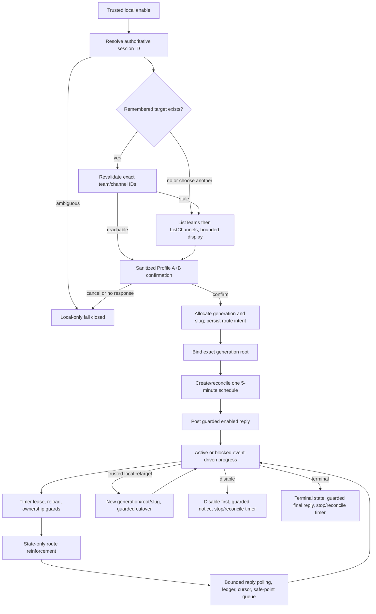

# Semantic Integration Verification — Attempt 1

**Task:** `validation-semantic-flow`
**Lane:** DevDude validation attempt 1 — Semantic Verification
**Scope:** Read-only semantic review of the approved design, rewritten Markdown skill, and static
contract tests. This report provides evidence to Feature-Validator and does not issue the final
validation verdict.

## Objective and completion criteria

Verify that `enable-progress-in-teams/SKILL.md` describes an end-to-end behavior matching the
original request and approved Profile A+B design, including:

- selectable Teams/channel routing with a session-scoped slug;
- remembered-target and trusted local retarget flows;
- one recurring 5-minute timer for routing reconciliation and reply polling in active and blocked
  states;
- monotonic generations, generation-specific roots, schedule ownership, cursor/ledger semantics,
  explicit authorization, disable, and terminal cleanup;
- honest polling/cost limitations; and
- alignment between the implementation and the 73 static contract assertions.

Completion evidence is the requirement trace, flow trace, state-transition review, exact findings,
test-gap analysis, and validator-ready conclusion below.

## Evidence reviewed

| Evidence | Locator |
|---|---|
| Original request | `original-request.md`, requirements 1–5 |
| Approved policy selections | `approved-design.md`, complete document |
| Normative core | `design-options.md` §§3.1–3.9 |
| Approved Profile A+B UX | `design-options.md` §§4.1–4.2 |
| Status, failure, and operational semantics | `design-options.md` §§5–7 |
| Implementation scope | `implementation-plan.md`, Required invariants 1–13 |
| Production behavior | `enable-progress-in-teams/SKILL.md`, Hard invariants and Workflow Phases 1–7 |
| Schedule/cursor/failure behavior | `SKILL.md`, Schedule ownership contract, Response-handling rules, Failure handling, Residual limitations |
| Implementation claims | `implementation-summary.md`, “What changed, mapped to the approved design” |
| Executable static checks | `enable-progress-in-teams/tests/SkillContract.Tests.ps1` |
| Test results and limitations | `test-summary.md`, “Commands and results” and “Uncovered risks” |

The static suite was rerun during this lane and completed with exit code `0`:
`PASS: 73 static skill contract assertions passed.`

## Requirement-by-requirement semantic trace

| Requirement | Implementation trace | Semantic result |
|---|---|---|
| Query and present teams/channels instead of a hard-coded destination | `SKILL.md` Phase 1 steps 2–4 calls `ListTeams`, then `ListChannels`, presents numbered rows, and routes only by confirmed canonical IDs. Hard invariants 1–2 forbid a built-in destination and name/slug routing. Legacy IDs are absent. | Implemented coherently. |
| Persist selection as a session-scoped slug | Canonical vocabulary defines the slug as opaque and session-scoped. Phase 1 step 5 allocates a fresh slug and stores it with canonical IDs and generation history only after confirmation. | Implemented coherently. |
| Change target and update the slug | Phase 5 requires trusted local reselection/confirmation, allocates a new generation, creates/binds its root, CAS-commits new IDs/root/slug, and leaves prior history immutable. | Implemented, with transition-order ambiguity in finding **SV-04**. |
| One recurring timer reinforces routing idempotently | Hard invariant 8 and Phase 4 define one 5-minute schedule. Phase 4 step 4 treats reinforcement as a state-integrity check and performs no steady-state Teams write. Repair is bounded and trigger-based. | Implemented coherently. |
| Timer continuously listens during active and blocked states | Phase 3 creates no blocked-only timer. Phase 4 polls the current root on every runnable tick independent of active/blocked state. Residual limitations correctly qualify this as best-effort polling rather than guaranteed interruption. | Implemented coherently. |
| Remove the old blocked-only listener | The old listener table/key and 4-hour lifecycle are absent. Phase 3 explicitly prohibits a second schedule/listener. | Implemented coherently. |
| Profile A+B confirmation | Phase 1 offers a remembered target first, revalidates exact IDs, otherwise lists teams/channels, and converges on one explicit confirmation gate before persistence or Teams writes. | Implemented coherently. |
| 50-row bound and incomplete discovery disclosure | Phase 1 step 3 caps each selection surface at 50 returned items, states returned/shown counts, and never claims tenant-wide completeness. | Implemented; not directly asserted by the static suite. |
| Duplicate names and membership types | Phase 1 adds canonical ID fragments for duplicate names and discloses `standard`, `private`, or `shared` membership plus audience caveats. IDs, not names/fragments, remain canonical. | Implemented; eligibility/details are weakly covered by tests. |
| Cancellation and no response | Selection always offers cancel; cancellation and bounded no-response both perform zero persistence and zero Teams writes and continue locally. | Implemented; not directly asserted beyond prose presence. |
| Stale/deleted target | Remembered-target revalidation fails closed and offers reselection. Failure handling forbids substitution and preserves the prior route during failed retarget. | Implemented coherently. |
| Monotonic generations and generation-specific roots | Hard invariants 3, 4, and 6; generation counter/history schema; Phase 1 bounded marker binding; and Phase 5 cutover prohibit reset/reuse and prior-root reuse. | Implemented coherently. |
| No history migration on retarget | Phase 5 creates a new root, keeps history immutable, posts at most one guarded old-root handoff, and reads only the new root after cutover. | Implemented coherently. |
| Separate explicit authorization | Hard invariant 7 and the separate authorization table retain the fixed sender ID, require exact sender ID plus leading `[ToAgent]`, fail closed on empty/unresolved authorization, and prohibit retarget from changing authorization. | Implemented, with a concurrent revision guard gap in **SV-03**. |
| Teams text cannot mutate controls | Hard invariant 9 and Response-handling rules mark surfaced text `teams-origin`, route it through normal local approval, and prohibit enable/disable/retarget/cadence/authorization/schedule/root mutation. | Implemented coherently. |
| Schedule intent/CAS/lease prevents multiple authoritative timers | The schedule contract writes intent before create, persists/adopts the handle conditionally, stops extras, retains uncertain stop states, and leases each tick. | Directionally implemented, but the durable CAS token is under-specified in **SV-02**. |
| Cursor/ledger/backlog prevents replay or skip | Phase 4 specifies bounded pages, chronological sorting, ledger-before-surface, careful watermark advancement, overlap re-scan, and degradation after three exhausted ticks. | Replay protection is described; composite cursor skip prevention is incomplete in **SV-01**. |
| Status | Phase 6 reports target, slug/generation/root, lifecycle, schedule/lease, cadence/limitations, authorization/listening, cursor/backlog, and errors without posting to Teams. | Implemented coherently. |
| Disable and terminal cleanup | Phase 7 disables first, stops by persisted handle, retains `stop_failed`, marks terminal durably, guards terminal posting, and assigns later reconciliation ownership. Restored ticks perform no Teams operation. | Implemented coherently. |
| Honest limitations and cost | Residual limitations disclose about five-minute nominal latency, about 288 ticks/day plus bounded work, session-running dependence, and no webhook/durable-queue/preemption guarantee. | Implemented coherently. |

## End-to-end behavioral flow

### Flow-specific evidence

| Flow | State and integration semantics | Evidence locator |
|---|---|---|
| Enable | No side effects before confirmation; exact IDs are revalidated; generation/slug are allocated transactionally; root binding is bounded and marker-specific; schedule ownership precedes the enabled reply. | `SKILL.md` Phase 1 |
| Remembered target | The alias is never resolved by name; exact IDs must still exist and pass the common confirmation gate. Re-enable allocates a never-used generation/slug rather than reviving an old root. | Phase 1 steps 2, 4–5; Hard invariant 6 |
| Change target | Trusted local only; old/new audience and no-history effects are confirmed; new root is durable before current-route commit; old generation becomes stale; one timer remains. | Phase 5 |
| Timer creation | Intent precedes external create; returned handle is persisted/adopted only if current; failed persistence stops the new timer; extras are reconciled by logical key and handle. | Schedule ownership contract |
| Tick | Lease acquisition, reload, terminal/disabled self-stop, per-effect ownership checks, state-only reinforcement, bounded current-root polling, ledger-before-surface, watermark discipline, and safe-point queueing. | Phase 4 |
| Blocked | One safe blocker reply is posted under the current generation root; the existing timer remains the only listener in active and blocked states. | Phase 3 |
| Disable | `enabled = 0` and `disabled` are committed before stop; at most one guarded notice; uncertain stop remains visible and recoverable. | Phase 7, Disable |
| Terminal | Terminal state prevents restored-tick reads/writes; one guarded terminal reply and schedule stop/reconciliation are attempted. | Phase 7, Terminal cleanup |

## State-transition consistency

| Transition | Required ordering | Review |
|---|---|---|
| Unconfigured/disabled → enable pending | Resolve identity and confirm before allocating or writing. | Consistent. |
| Enable pending → enabled | Allocate generation/slug, persist route/root intent, bind root, create/reconcile schedule, re-check ownership, then post enabled reply. | Consistent; explicit degraded-state updates after partial failure are mostly delegated to Failure handling rather than enumerated per step. |
| Enabled → tick lease → released | CAS lease, reload, guard before effects, release. Overlaps wait or reconcile. | Consistent. |
| Enabled generation N → retarget pending → generation N+1 | Confirm, create transition, bind N+1 root, commit N+1, stale N, optional guarded handoff. | Semantically correct goal; exact allocation/transition ordering is ambiguous in **SV-04**. |
| Enabled → disabled | Mark disabled before stop; no later tick Teams effect; uncertain stop remains visible. | Consistent. |
| Enabled/disabled → terminal | Mark terminal, perform only the direct guarded finalization path, stop/reconcile schedule; restored ticks self-stop without Teams access. | Consistent. |
| Healthy backlog → continuation → listening_degraded | Retain prior watermark on incomplete scan; after three consecutive bound-exhausted ticks mark degraded. | Consistent except for the timestamp-only qualification in **SV-01**. |

## Exact semantic findings

### SV-01 — Composite watermark is declared but not used as a composite comparison

**Severity:** Material cursor correctness gap
**Design:** `design-options.md` §3.1 defines the durable watermark as
`(createdDateTime, message_id)`; §3.7 sorts and consumes deterministically and requires no skipping.
**Implementation:** `SKILL.md` Canonical vocabulary also declares the tuple, and Phase 4 step 6
sorts by `(createdDateTime, message_id)`, but qualification requires only that
`createdDateTime` be “newer than the watermark.” It does not state the required lexicographic
comparison:

`createdDateTime > watermark_created_at OR (createdDateTime = watermark_created_at AND message_id > watermark_message_id)`.

**Impact:** Two replies with the same timestamp can be sorted correctly but the later message ID
can be excluded after the first becomes the watermark, causing a skip despite overlap scanning and
ledger deduplication.
**Test gap:** `SkillContract.Tests.ps1` checks that both watermark columns and the ledger exist, and
checks no advancement after exhausted scans, but does not assert composite tuple comparison or a
same-timestamp tie case.

### SV-02 — Schedule CAS has no explicit durable revision/generation token

**Severity:** Material ownership-specification gap
**Design:** `design-options.md` §3.1 requires schedule ownership to include
`schedule_generation`; §3.6 requires CAS on
`(session_id, logical_schedule_key, expected_revision)`.
**Implementation:** `SKILL.md` state includes `logical_schedule_key`, `schedule_id`,
`schedule_status`, and lease fields, but no schedule revision/generation field. The Schedule
ownership contract says CAS on `(session_id, logical_schedule_key)` and adopts the handle only if
the “generation/owner is still current,” without identifying the durable owner revision being
compared.

**Impact:** Intent, handle reconciliation, and tick leases substantially reduce duplicate effects,
but the text does not fully prove that two concurrent creators for the same route generation cannot
both transiently regard themselves as authoritative before extra-schedule reconciliation. This is
the ABA/concurrent-create case the approved design required the expected revision to close.
**Test gap:** The static suite asserts presence/order of logical key, handle, and lease terms and
the prose for stopping extras, but not an expected revision, schedule generation, or equivalent
durable CAS token.

### SV-03 — Authorization revision is not rechecked at the per-effect boundary

**Severity:** Concurrent authorization consistency gap
**Design:** `design-options.md` §3.7 requires the authorization revision to be read before every
Teams read and write, and its flowchart rechecks that the sender remains authorized before claim.
**Implementation:** `SKILL.md` Phase 4 step 2 reloads state, but step 3’s per-external-effect guard
names enabled/terminal state, route generation, logical schedule key, and lease ownership only.
Step 6 checks membership in the loaded allowlist, while step 9 guards acknowledgement by current
generation only.

**Impact:** If a trusted local authorization revision removes a sender during a tick, the captured
allowlist can still be used to claim/surface/acknowledge that sender’s message. Destination
retargeting remains isolated from authorization as required, but concurrent authorization updates
are not fully guarded.
**Test gap:** The suite verifies that `authorization_revision` and separate authorization state are
present and that retarget does not write them; it does not assert revision reload/recheck before
claim or acknowledgement.

### SV-04 — Retarget transition wording orders the transition before generation allocation

**Severity:** State-transition ambiguity
**Design:** `design-options.md` §§3.1 and 3.8 require a transition keyed by `to_generation`, written
before any new-channel write. Generation may be allocated before that transition as long as no
Teams write occurs first.
**Implementation:** `SKILL.md` Phase 5 step 2 says to write the `new_root_pending` transition row
and then “Allocate the next monotonic generation.” The transition schema requires
`to_generation` as part of its primary key.

**Impact:** A literal executor cannot create the correctly keyed transition before knowing the
allocated generation. The intended safe ordering is inferable but should be explicit:
transactionally allocate N+1, write the N→N+1 transition, then perform the first new-channel write.
**Test gap:** The static suite checks that retarget requires a new generation but does not assert
generation allocation before the keyed transition or transition persistence before Teams writes.

## Static-test alignment and important uncovered behavior

The 73 assertions are useful regression checks for frontmatter, required vocabulary, removed legacy
terms, cadence consistency, broad invariant prose, failure headings, and completion shape. They do
not execute Teams, scheduling, SQL transactions, pagination, or concurrent state changes, as the
test summary correctly states.

Important behavior not proven by those assertions:

1. Composite `(createdDateTime, message_id)` watermark ordering and same-timestamp replies.
2. A durable expected revision/schedule generation closing concurrent create and ABA cases.
3. Authorization-revision rechecks during an in-flight tick.
4. Executable ordering of generation allocation, transition persistence, and first new-channel
   write.
5. The exact 50-row selection limit, standard/private/shared eligibility, duplicate-row selection,
   and cancellation/no-response zero-side-effect behavior.
6. Remembered-target stale-ID behavior and prohibition on name-based re-resolution.
7. No-history migration, one guarded old-root handoff, and rejection of old-root replies after
   cutover.
8. Status being strictly read-only.
9. Disable/terminal restored-schedule behavior and `stop_failed` recovery ownership.
10. Runtime compatibility with deferred Teams/scheduler schemas and live pagination.

## Validator-ready conclusion

The rewritten skill integrates the requested selectable destination, session slug, trusted
retarget, unified five-minute timer, active/blocked listening, legacy-listener removal, generation
roots, explicit authorization, bounded backlog handling, status, disable, terminal cleanup, and
honest polling limitations into one mostly coherent behavioral contract.

Feature-Validator should account for four semantic gaps not detected by the passing static suite:
the missing composite cursor comparison (**SV-01**), under-specified durable schedule CAS token
(**SV-02**), missing per-effect authorization-revision guard (**SV-03**), and ambiguous retarget
generation/transition ordering (**SV-04**). This report intentionally leaves the final validation
decision to Feature-Validator.
